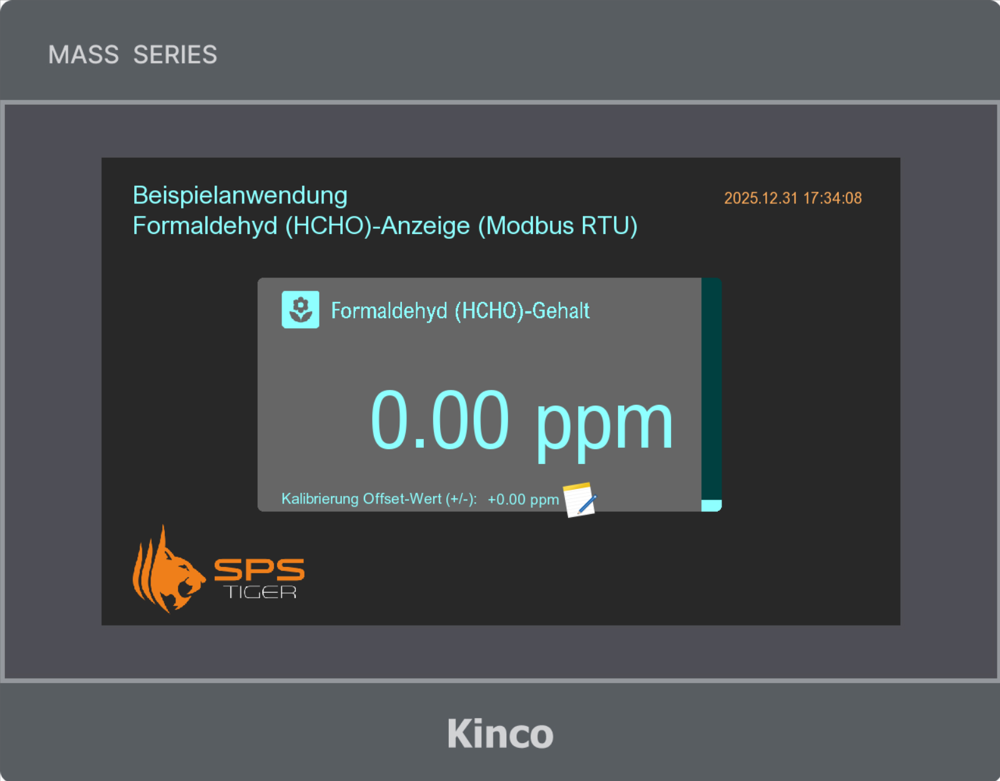
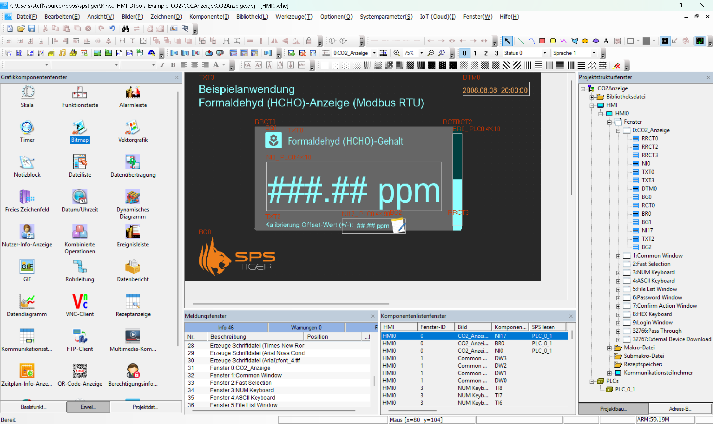
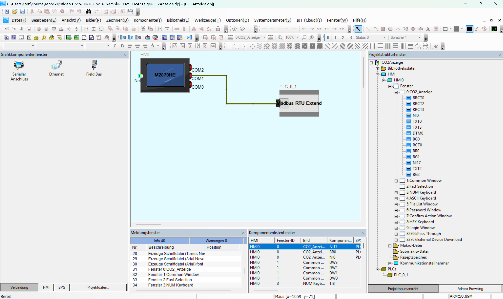

# Kinco HMI DTools Beispiel Messwertanzeige Modbus RTU (Beispielwert Formaldehyd HCHO)

Example program of HCHO Display Kinco HMI made with DTools

Dieses Beispielprogramm für ein Kinco GT070HE zeigt, wie man einen **Messwert** auf dem HMI skalieren und darstellen kann. Das Projekt wurde für einen ComWinTop Formaldehyd-Sensor erstellt (SAQ-Reihe).  

## Das ist im Beispielprogramm enthalten

* **Zahlenanzeige** für Formaldehyd mit Skalierung im Anzeigeelement und Einheit als Label (ppm)
* Anzeige und Eingabe der Kalibrierung (Offset)
* **Rechtsbündige Ausrichtung** des Werts für bessere Darstellung
* Anpassung aller **Schriftarten** auf Arial Nova für attraktive Darstellung
* Abgerundetes Rechteck, Überschrift für Messwert und Icon als statisches Bitmap (importiertes PNG)
* Komponente **Balkendiagramm** rechts zur Darstellung des Wertes als Balken**
* Anpassung der **Zifferntastatur** mit passender Farbdarstellung und Arial Nova als Tastaturschriftart
* Anpassung der **Systemmeldung** für falsche Eingabe des Rohwertes - Sprache und Schriftart der Meldung

Das Projekt wurde für das Kinco HMI GT070HE mit einer Auflösung von 1.024 x 600 Pixeln erstellt. Die Kinco HMI der GL100E und GT100E-Serie sowie das GT070E2 haben eine gleiche Auflösung. Das Projekt kann für diese Modelle einfach per Rechtsklick auf das HMI in DTools konvertiert werden. 
Für HMI mit anderer Auflösung ist eine Konvertierung über diesen Weg ebenfalls möglich, es werden aber wahrscheinlich Nacharbeiten notwendig, um die Darstellung an das HMI anzupassen.

Das Programm wurde in der Entwicklungssoftware Kinco DTools 4.4.0.3 erstellt.

## So ladet ihr das Programm herunter

### Variante 1:

Unter "<> Code" findet ihr einen Link zum "Download ZIP"

### Variante 2:

Wenn ihr euch in Github registriert und Github Desktop installiert, könnt ihr das Programm **klonen** und so als lokale Kopie auf eure Festplatte holen.

